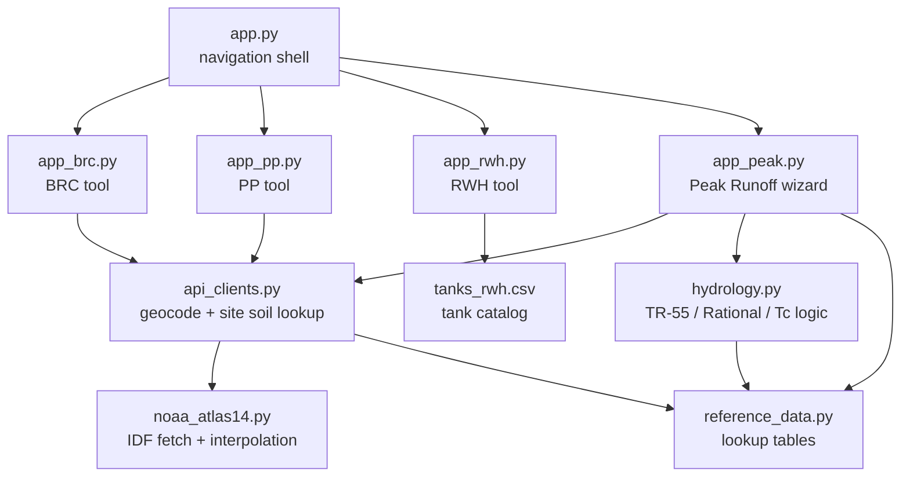
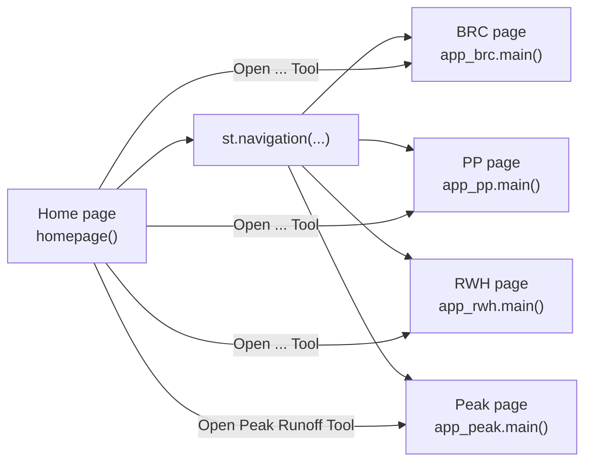
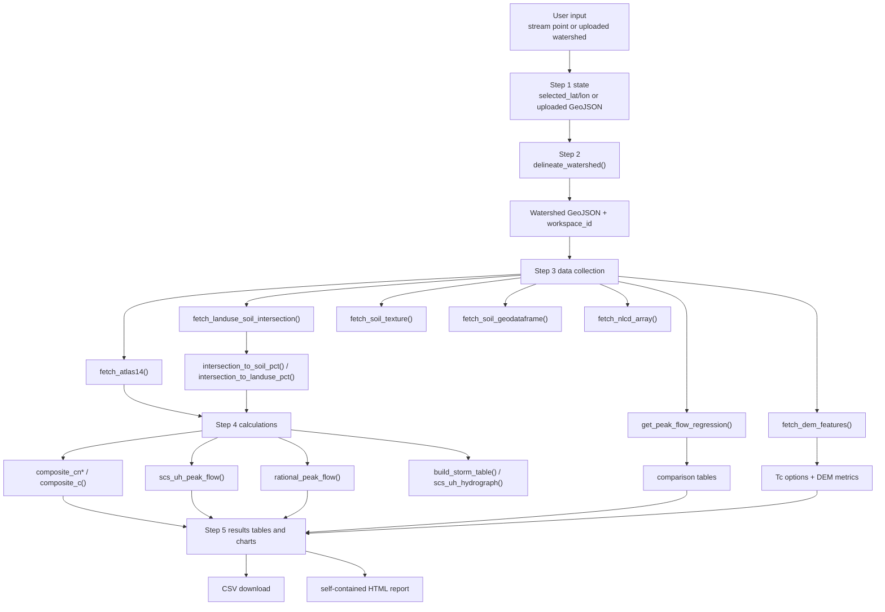

# Architecture

## Overview

This repository is a single Streamlit application composed of:

- one navigation shell in `app.py`
- four page entrypoints (`app_brc.py`, `app_pp.py`, `app_rwh.py`, `app_peak.py`)
- three shared computation/data modules (`api_clients.py`, `hydrology.py`, `noaa_atlas14.py`)
- one static reference-data module (`reference_data.py`)
- one bundled CSV dataset (`tanks_rwh.csv`)

The design intentionally keeps the three LID sizing tools self-contained while the Peak Runoff tool uses a deeper shared stack for hydrology and geospatial data acquisition.

## Top-Level Module Relationships

## Runtime Navigation Flow

[`app.py`](/Users/ashishojha/Documents/LID excels/app.py) is the only application entry point. It:

- sets the Streamlit page configuration
- imports each page module's `main()` entrypoint
- defines a home page with four launch cards
- registers each page with `st.Page(...)`
- groups pages under `st.navigation(...)`

The application does not use a separate routing layer, API server, or package structure. Streamlit page registration is the routing model.

## Page Responsibilities

### `app_brc.py`

- Owns the bioretention workflow UI and chapter-specific equations.
- Maintains BRC-specific Streamlit session state for map selection, geocoding, and site-scale soil lookup.
- Calculates loading ratio, SWV, drawdown, storage, and optional underdrain orifice metrics.
- Generates a one-page PDF report in-process with ReportLab.

### `app_pp.py`

- Owns the permeable pavement workflow UI and chapter-specific equations.
- Maintains PP-specific session state for address and map-driven soil lookup.
- Calculates SWV, storage depth limits, drawdown, loading ratio, and underdrain/orifice checks.
- Generates a one-page PDF report with ReportLab.

### `app_rwh.py`

- Owns the rainwater harvesting workflow UI and section-specific equations.
- Loads the bundled tank catalog, preselects a candidate tank, and allows manual overrides.
- Calculates required storage volume, orifice geometry, detention time, and first-flush diverter sizing.
- Generates a one-page PDF report with ReportLab.

### `app_peak.py`

- Implements a five-step stateful wizard rather than a single static page.
- Uses `st.session_state` as the workflow state store for:
  - selected point or uploaded watershed
  - collected precipitation, soil, land-use, and DEM data
  - computed CN, C, Tc, and results tables
  - map viewport state
- Generates interactive Folium maps, Plotly charts, CSV download output, and a self-contained HTML report.

## Shared Service Boundaries

### `api_clients.py`

This module is the boundary between the app and public external services. It owns:

- watershed delineation and basin characteristics from USGS StreamStats
- Atlas 14 fetch orchestration through `noaa_atlas14.py`
- SSURGO soil and texture retrieval
- site-scale soil sampling for BRC and PP
- NLCD land-cover acquisition and transformation into app land-use categories
- NLCD x SSURGO rasterized intersection logic
- DEM acquisition, masking, and derived terrain summaries
- U.S. Census address geocoding

This is also where most cross-library geospatial handling happens: Shapely, GeoPandas, Rasterio, PyProj, Py3DEP, and Pysheds.

### `hydrology.py`

This module contains pure calculations only:

- composite CN and rational runoff coefficient `C`
- CN runoff depth
- SCS Type II storm table generation
- SCS unit hydrograph convolution
- Rational peak flow
- time-of-concentration utilities

It does not fetch data or perform I/O.

### `noaa_atlas14.py`

This module turns Atlas 14 CSV output into an `IDF` object that supports:

- `depth(duration_hr, ari_yr)`
- `intensity(duration_hr, ari_yr)`
- summary-table generation
- optional Sherman IDF parameter fitting

## Session State Patterns

The codebase uses three distinct session-state patterns:

1. BRC and PP use narrow, tool-local state keys for:
   - selected coordinates
   - address lookup fields
   - inferred soil type
   - map center and zoom

2. RWH is mostly stateless except for auto-filled tank inputs that are updated when required volume changes.

3. Peak Runoff uses session state as a full finite-state workflow store. The `step` key is the primary control variable, and almost every expensive API result is cached in session state to avoid redundant calls.

Important implications:

- Peak Runoff is the only page with explicit wizard progression and a reset path.
- Step transitions are user-driven once prerequisite data exists.
- Data collection is intentionally separated from calculation and final presentation.

## Report Generation Paths

- `app_brc.py`, `app_pp.py`, and `app_rwh.py` each create PDF bytes directly from current inputs and calculated outputs using ReportLab `SimpleDocTemplate`.
- `app_peak.py` builds a fully self-contained HTML report, including figures encoded as inline base64 image assets.

The report paths are independent per tool. There is no shared reporting framework.

## Peak Runoff Data Flow

## Architectural Constraints

- The repository is a flat module layout, not an installable package.
- Shared logic is only partially centralized. BRC, PP, and RWH keep tool-specific equations inside their app modules.
- The Peak Runoff tool is the integration-heavy subsystem and is therefore the main maintenance hotspot.
- Current documentation should preserve the distinction between local calculation modules and network-backed data acquisition modules.
